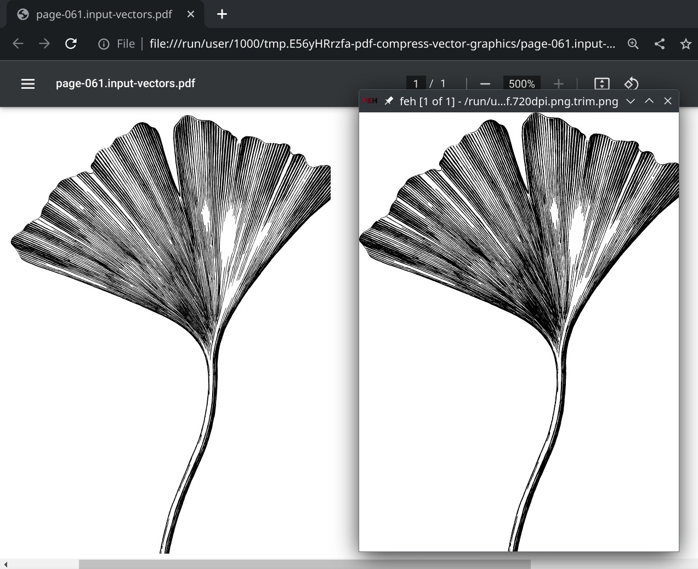
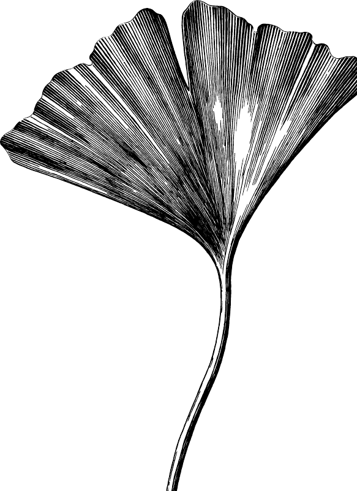
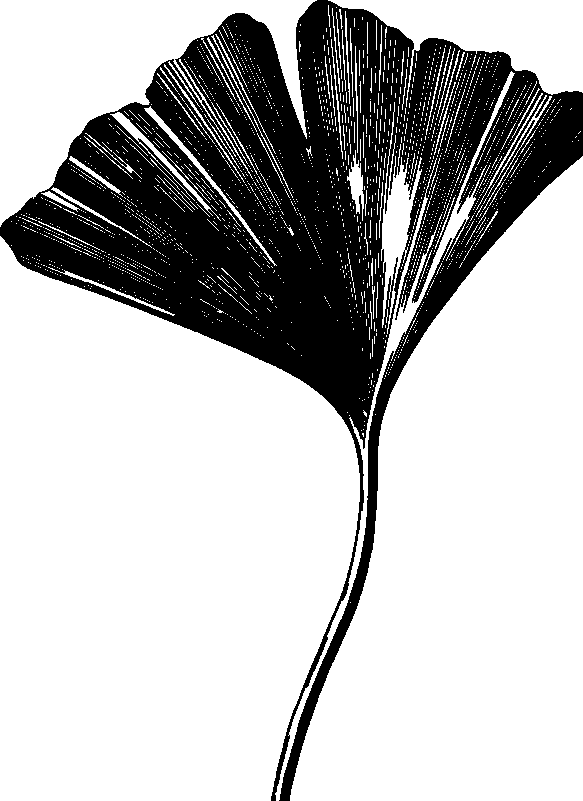

# pdf rendering chromium versus pdftoppm

i want to render PDF vector graphics to high quality raster graphics

for this job im using pdftoppm, but surprisingly,
it creates a slightly different result than the chromium pdf renderer:

with pdftoppm, fine black lines are darker, so overall, the graphic looks darker

the screenshot is with chromium PDF reader at full zoom (500%) which gives the same size as a 720dpi resolution image

i have tried running pdftoppm with different options, and only `-aaVector no` makes the result [worse](page-061.input-vectors.pdf.720dpi.aaVector-no.png.trim.png). so i guess im looking for a PDF rendering engine with more vector anti-aliasing.

| `pdftoppm` | `pdftoppm -aaVector no` |
| ------ | ------ |
|  |  |

upstream issue: https://gitlab.freedesktop.org/poppler/poppler/-/issues/1423
